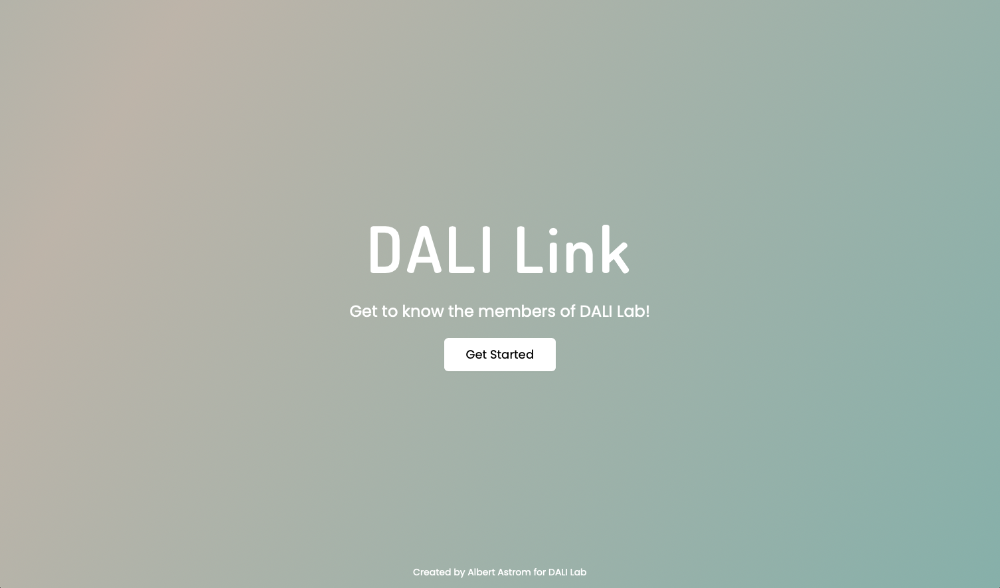
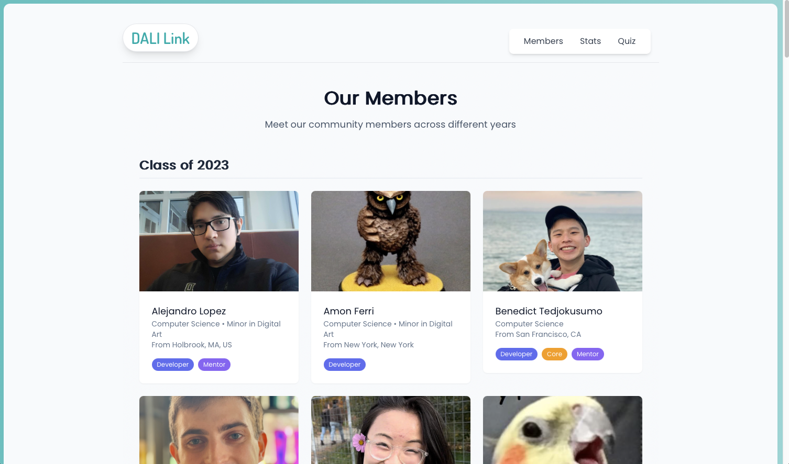
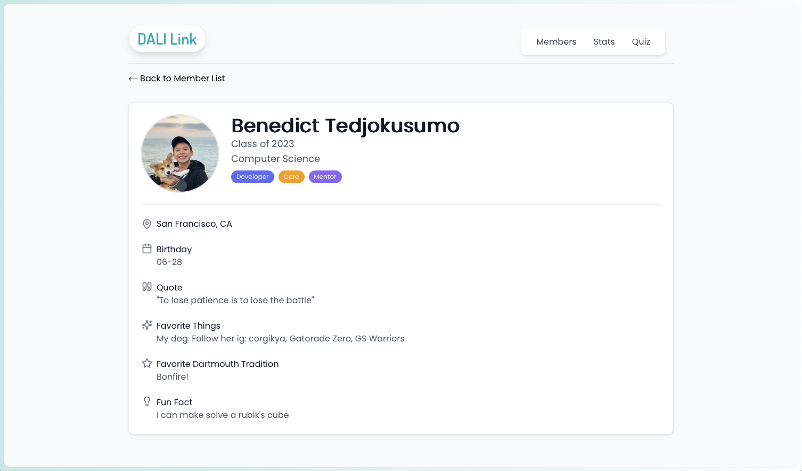
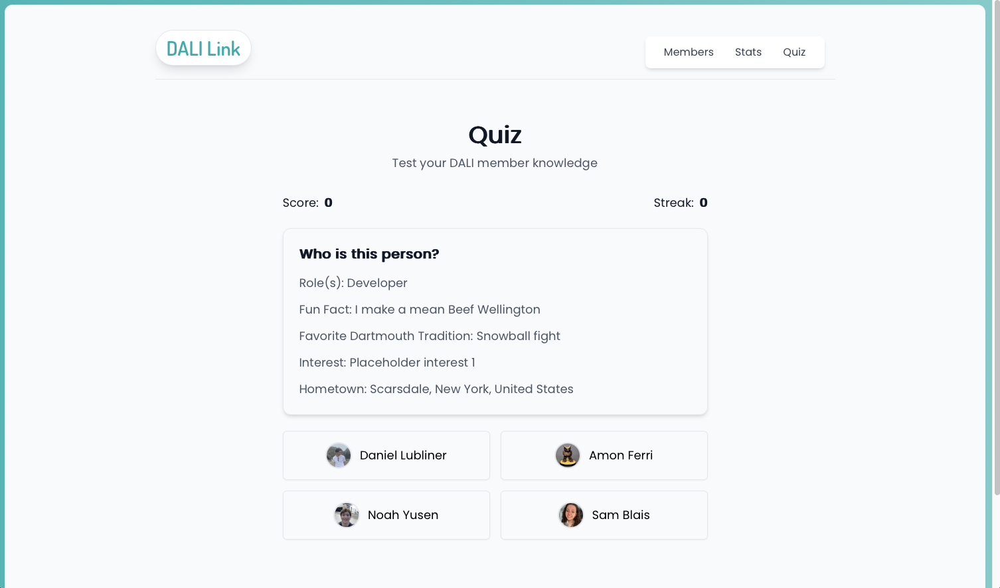

# DALI Link

## Description
DALI Link is a web application focused on introduction the members of DALI Lab to those who are unfamiliar. The application allows users to view a list of DALI Lab members, view their profiles, quiz themselves on their knowledge, and see some stats for the lab.

Submission for [Social Media Challenge](https://dalilab.notion.site/Social-Media-Challenge-72a37c4d33d44de194e66253e7efe7a0).

## Deployment
[https://dali-link.vercel.app/](https://dali-link.vercel.app/)

## Screenshots






## Technologies Used
- React.js
- Next.js
- Tailwind CSS
- MongoDB Atlas
- Node.js
- Vercel

## Local Setup
1. Clone the repository
   ```bash
   git clone https://github.com/albertastrom/dali-link-public-new.git
   cd dali-link-public-new
   ```

2. Install dependencies
   ```bash
   npm install
   ```

3. Set up environment variables
   ```bash
   touch .env
   # Add your environment variables to .env
   ```

4. Run the development server
   ```bash
   npm run dev
   ```

5. Open [http://localhost:3000](http://localhost:3000) in your browser

## Learning Journey

### Project Inspiration
I chose the social media challenge because it offered the a good balance of structure and open-ended options. The requirements to build a full-stack application with database integration aligned well with my technical skills, while allowing me to create something I thought was fun and unique. The project's scope let me demonstrate both frontend and backend capabilities. It also gave me a chance to learn about a ton of the DALI lab members throughout the process. 

### Potential Impact
DALI Link has the potential to serve as a bridge between prospective members and the current DALI Lab community. By providing an interactive platform to learn about lab members, it helps interested students better understand the lab's culture and evaluate their potential fit. The project also simplifies the process of maintaining and updating member information, making it easier for the lab to keep their community profile current and engaging.

### Technical Learning
This was my first time using any MongoDB service, but wanted to prototype with NoSQL (wasn't certain what I would land with schema-wise) and something free. Atlas was highly recommended for this kind of project with Next.js. After signing up, it was only a few minutes before I was first able to connect the DB to my app and start pulling some data. The provided docs were all I needed to get things running. 

### Challenges and Solutions
The main technical hurdle I faced was managing API security and request volume. At one point I had made a script that ran more than I expected it to. It had direct access to filling the db with data. It filled it with lots of entires I didn't want for testing, which worried me about starting to incur costs. While in this case, I was my own attacker, I realized that key endpoints needed more protections. I added rate limiting (on my end) and authorization headers to critical endpoints to prevent abuse. 


## API Docs
### Member Endpoints
GET /api/users
- Retrieves all DALI Lab members

GET /api/get-user?fullName={name}&year={year}
- Retrieves a specific member by full name and year

GET /api/random
- Retrieves a random member's profile

POST /api/load-users
- Loads member (one or many) data into database
- Rate limited to once per hour per IP

DELETE /api/delete-users
- Deletes all member data
- Requires authorization header

## Feature Endpoints
GET /api/quiz
- Generates a quiz with 4 random members
- Returns one member's info and multiple choice options

GET /api/stats
- Returns analytics including:
  - Total member count
  - Role distributions
  - Year breakdown
  - Major distribution
  - Role overlaps